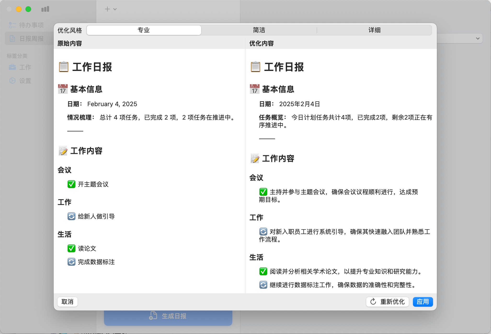

# Workgen 应用集成平台

> 让应用连接更智能 | [立即下载](#download) | [观看演示视频](https://demo.workgen.com)

  

    <h1>重新定义应用集成方式</h1>
    

      

        
3000+

        
企业用户

      

      

        
95%

        
部署效率提升

      

    

    

      <a href="#download" class="primary-btn">免费试用</a>
      <a href="#features" class="secondary-btn">查看功能</a>
    

  

  

## ✨ 核心优势

  

    
    <h3>智能报告生成</h3>
    
自动化生成专业分析报告

  

  

    
    <h3>智能任务管理</h3>
    
AI 辅助的任务分配与追踪

  

  

    
    <h3>数据分析</h3>
    
直观的数据可视化与分析

  

## 📊 平台概览

  
  

## 📦 下载体验

  
  

    <h2>立即开启智能集成</h2>
    

      <label>选择版本：</label>
      <select>
        <option>社区版（免费）</option>
        <option>专业版</option>
        <option>企业版</option>
      </select>
    

    

      
    

  

## 📌 用户见证

  

    
    <blockquote>
      "集成效率提升3倍，运维成本降低60%"
    </blockquote>
    

      
XX商业银行

      
CTO 张先生

    

  

  

    
    <blockquote>
      "最佳的中型企业应用集成方案"
    </blockquote>
    

      
YY跨境电商

      
技术总监 李女士

    

  

  <h2>可靠的技术支撑</h2>
  

    
    
    
  

