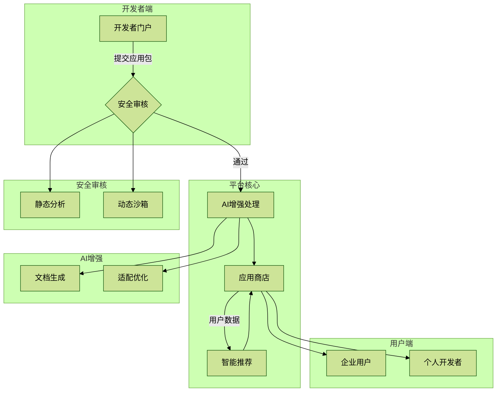
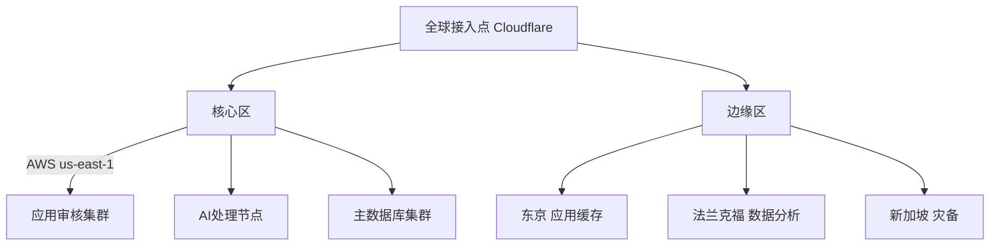
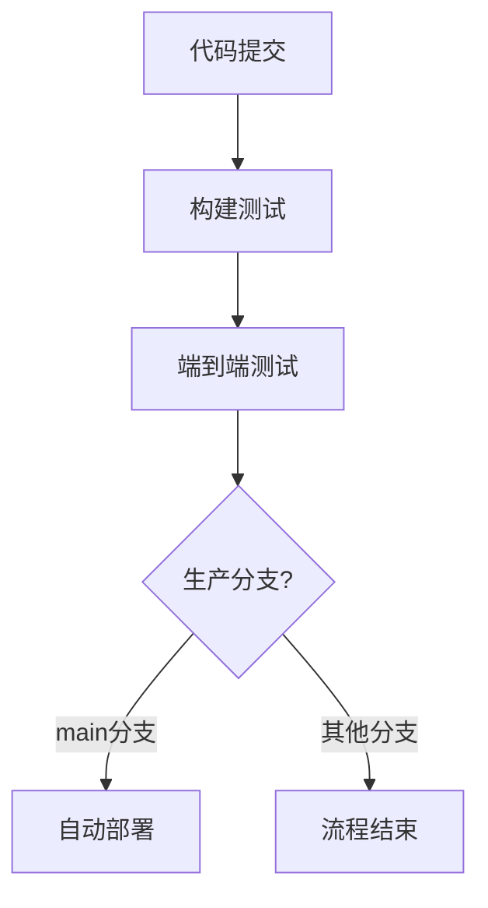
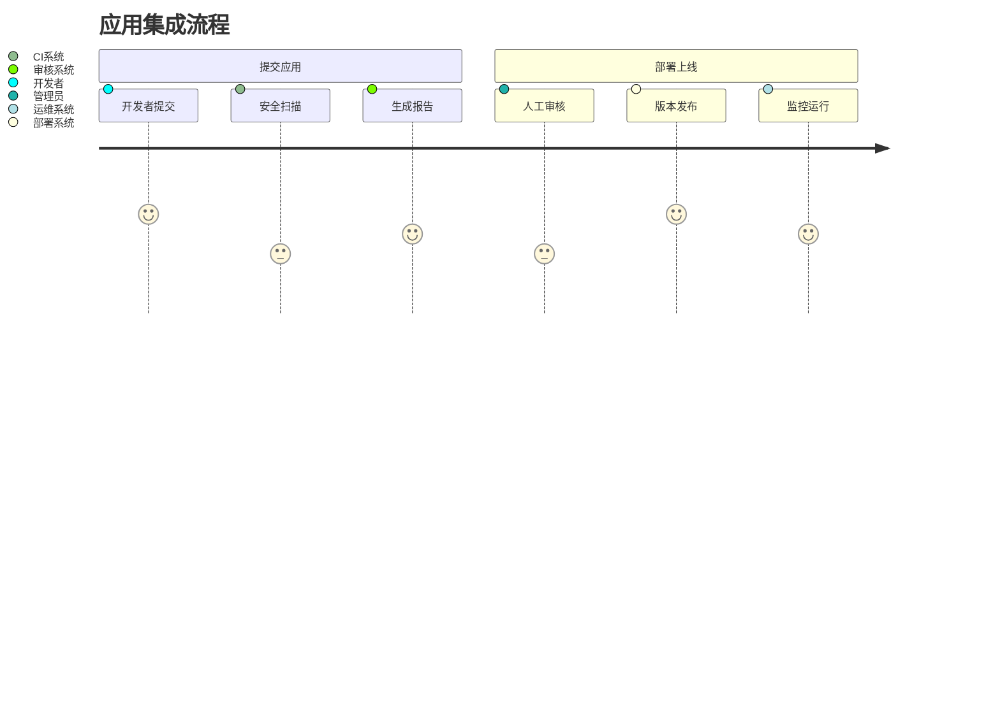

# Workgen 应用集成平台
[](https://opensource.org/licenses/MIT)
[](https://makeapullrequest.com)

> 新一代AI增强型应用集成市场，助力提升工作效率与智能协作

<div class="header">

</div>

## 架构设计理念
### 1. 分层解耦架构
采用"南北向流量+东西向服务"的混合架构模式：

## 核心设计理念

### 架构全景图
<div class="architecture-diagram">

</div>

## 关键技术决策

### 分层架构设计
| 层级 | 技术栈 | 关键决策点 |
|------|--------|------------|
| **展示层** | Next.js + React18 + TypeScript | 支持SSR和静态生成，优化SEO |
| **网关层** | Nginx + Envoy | 支持金丝雀发布和流量镜像 |
| **服务层** | NestJS + gRPC | 模块化微服务架构 |
| **数据层** | PostgreSQL + Redis + Elasticsearch | 关系型+搜索+缓存的混合存储 |
| **AI层** | Python + ONNX Runtime | 平衡性能与模型兼容性 |

### 核心创新设计
1. **智能适配引擎**
   - 自动检测用户工作流模式
   - 动态推荐集成方案
2. **沙箱化执行环境**
   - 基于WebAssembly的隔离机制
   - 实时资源使用监控
3. **AI增强审核**
   - 代码合规性自动检查
   - 文档智能生成

## 安全架构设计

## 部署架构
<div class="deployment-flow">

</div>

## 当前进展
✅ **已实现核心功能**
- 应用提交基础验证流程
- 安全静态扫描引擎
- 开发者门户前端框架
- 基础REST API接口

🛠 **开发中功能**
- AI文档自动生成
- 沙箱执行环境
- 多集群部署方案

## 开发者指南

### 环境准备
```bash
# 前端开发
cd frontend && npm install

# 后端开发
cd backend && docker-compose up -d
```

### 贡献规范
1. 功能分支命名: `feat/[short-desc]` 或 `fix/[issue-num]`
2. 提交前必须通过:
   ```bash
   npm run lint && npm test
   ```
3. 新功能需提供API文档和交互流程图

## 路线图

### 2024 Q3-Q4
| 季度 | 重点任务 |
|------|----------|
| Q3   | 智能推荐系统上线<br>开发者声望系统 |
| Q4   | 移动端适配<br>全球加速网络部署 |

### 2025 规划
- 工作流可视化编辑器
- 跨应用智能编排引擎
- 企业级SLA保障方案

## CI/CD 工作流

### 三阶段自动化流程


### 核心优化
- 统一Node.js 20.x环境
- 并行化构建流程
- 智能缓存加速
- 自动失败重试机制

### 本地调试命令
```bash
# 运行完整测试
npm run test:all

# 启动开发服务器
npm run dev

# 生产构建
npm run build
```

